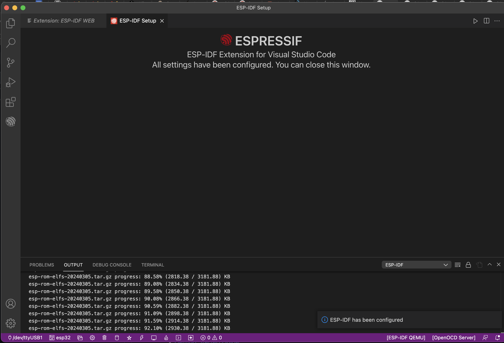

#  Install ESP32 IDF and Toolchain and Demonstrate ESP32 On-Board Blink

Author: Suhani Mitra

Date: 2024-09-05

### Summary

This skill was about installing ESP32 IDF and ensuring its functionality by making sure it can perform the on-board LED blink. I used Mac's homebrew to assist in the installation and followed the guidelines as per Espressif's documentation.

### Evidence of Completion

ESP Successful Installation

- [Link to video of blinking on-board LED](https://drive.google.com/file/d/1LZiPkUNRwXYLXw0n2yFt-5pl_rCG0jT4/view?usp=sharing).

### AI and Open Source Code Assertions

- I have documented in my code readme.md and in my code any
software that we have adopted from elsewhere
- I used AI for coding and this is documented in my code as
indicated by comments "AI generated" 

