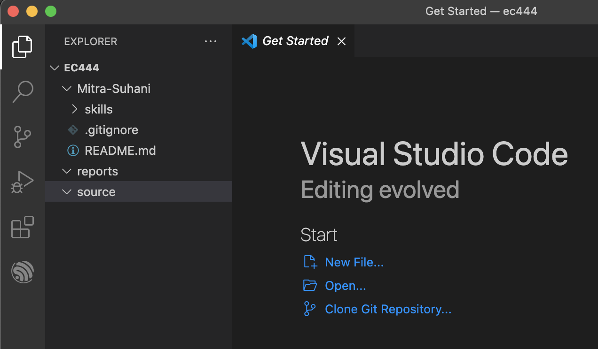

#  Setup Editors and IDEs

Author: Suhani Mitra

Date: 2024-09-05

### Summary

This skill was for organizational purposes. I created a 'reports' and 'source' folder to store reports and source code respectively. My cloned repository is also visible here as my overall 'ec444' folder contains all 3 of these folders. 

### Evidence of Completion

My Folder Setup in VSCode

### AI and Open Source Code Assertions

- I have documented in my code readme.md and in my code any
software that we have adopted from elsewhere
- I used AI for coding and this is documented in my code as
indicated by comments "AI generated" 

