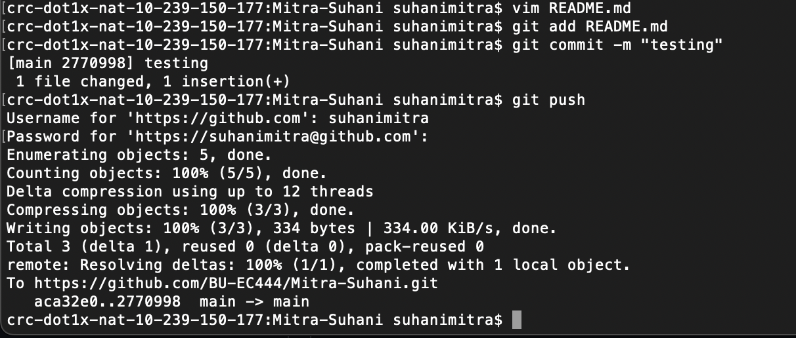

#  Setup and Use Github Individually

Author: Suhani Mitra

Date: 2024-09-05

### Summary

This skill asks to demonstrate proficiency with GitHub. I created a private repository based on the template and cloned this. I edited this README file, added the file, committed the changes, and finally pushed it through to GitHub. I also use GitHub Desktop in other cases to assist with this process.

### Evidence of Completion

GitHub Process for Committing README Changes (through terminal)

### AI and Open Source Code Assertions

- I have documented in my code readme.md and in my code any
software that we have adopted from elsewhere
- I used AI for coding and this is documented in my code as
indicated by comments "AI generated" 

