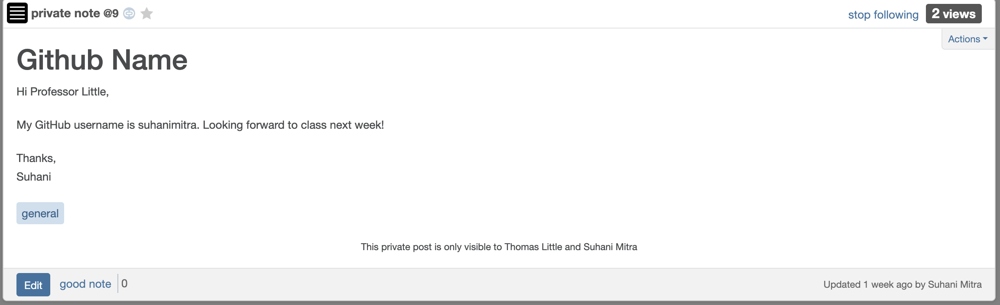

# Get access to Piazza and post something

Author: Suhani Mitra

Date: 2024-09-05

### Summary

This skill is about gaining access to Piazza and creating a bio post to ensure acceess is working. I uploaded a profile picture and created a post with my GitHub information.

### Evidence of Completion

My Piazza Post

### AI and Open Source Code Assertions

- I have documented in my code readme.md and in my code any
software that we have adopted from elsewhere
- I used AI for coding and this is documented in my code as
indicated by comments "AI generated" 

