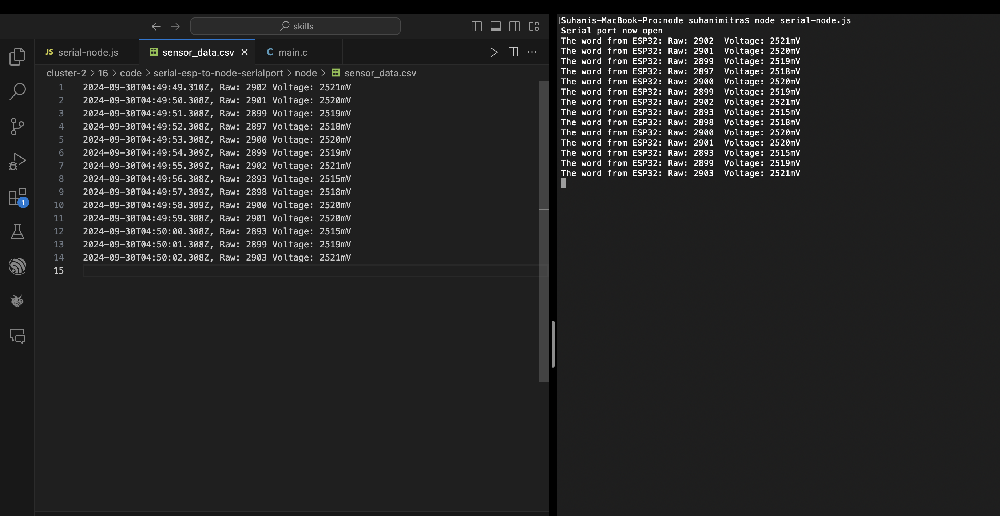

#  Node.js and Serial Data Saved to File

Author: Suhani Mitra

Date: 2024-09-29

### Summary

This skill invovled understanding Node.js and integrating it with ESP32. First, I oriented myself with Node.js by following some of the tutorials to better understand its functionality. I understood local hosts and how this was in conversation with a node app. To demonstrate this, I chose to reuse my voltage reading circuit and read these sensor readings from the ESP. I modified the given .js file to read from my local port. Then, once my previous code (to read voltage) was flashing and on the ESP, I opened up a node app to read from the port in real-time. The voltage data is consistent with my skill from cluster-01/07 (expected around 2500 mV) as I used the same circuit/resistor values from then.

Once this was open, I had the node app write the data it read into a .csv file with one line per data read (time and raw voltage value). The video below shows how the console data goes directly into the .csv file, due to the node app program that reads/writes it accordingly.

### Evidence of Completion

Screenshot of Data Relay Between Node and CSV File

- [Link to video demo of real time data read/write.](https://drive.google.com/file/d/1CNmMBUWHi86dd9RkDENi_pWoV68ZBcyp/view?usp=drive_link)

### AI and Open Source Code Assertions

- I have documented in my code readme.md and in my code any
software that we have adopted from elsewhere
- I used AI for coding and this is documented in my code as
indicated by comments "AI generated" 

