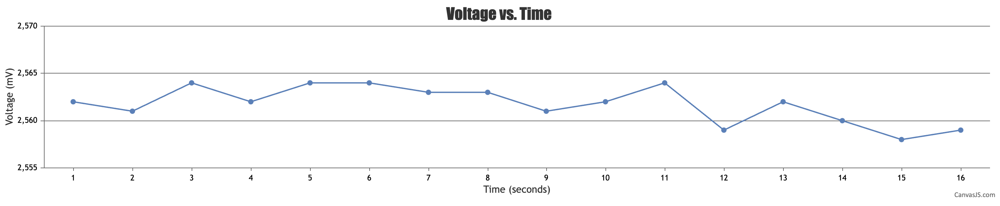

#  CanvasJS

Author: Suhani Mitra

Date: 2024-09-29

### Summary

This skill invovled integrating CanvasJS into an index.html file that is served by the node app. In this skill, I assumed that we could read data directly from the ESP32 (professor approved this).

To do this, I had the ESP32 send data readings to the UART. I used the same voltage reading circuit in this case. I then used the provided node app code that reads from the serial port, launches a server, and sends data to the client side. I altered the given index.html file to read the correct value from the port (the acutal voltage reading) and display this graphically. I modified the y-axis bounds so that we could better visualize the data readings.

In the video below we can see the ESP32 flashing, starting of the node app (server opens), and the consequent graph on the client side that updates in real time with the voltage readings from the ESP32.

### Evidence of Completion

Live Graph from Voltage Readings

- [Link to video demo of real-time node/canvas communication.](https://drive.google.com/file/d/1rp5LTH4nO-3Qqls5A52fgkvkAH_8JLiM/view?usp=drive_link)

### AI and Open Source Code Assertions

- I have documented in my code readme.md and in my code any
software that we have adopted from elsewhere
- I used AI for coding and this is documented in my code as
indicated by comments "AI generated" 

