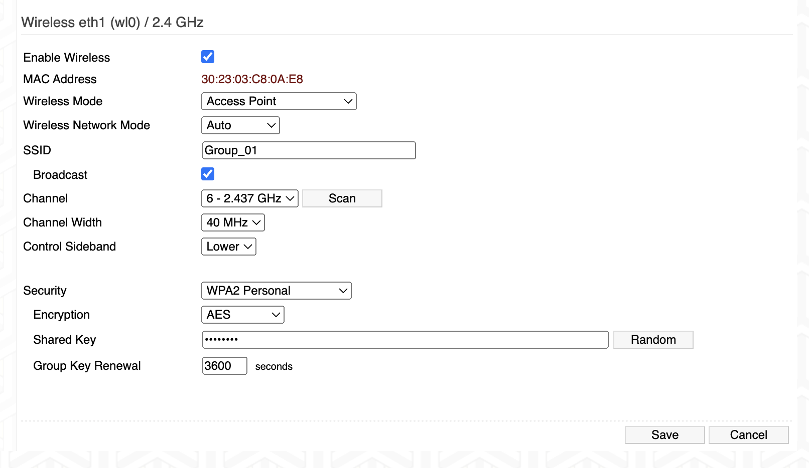
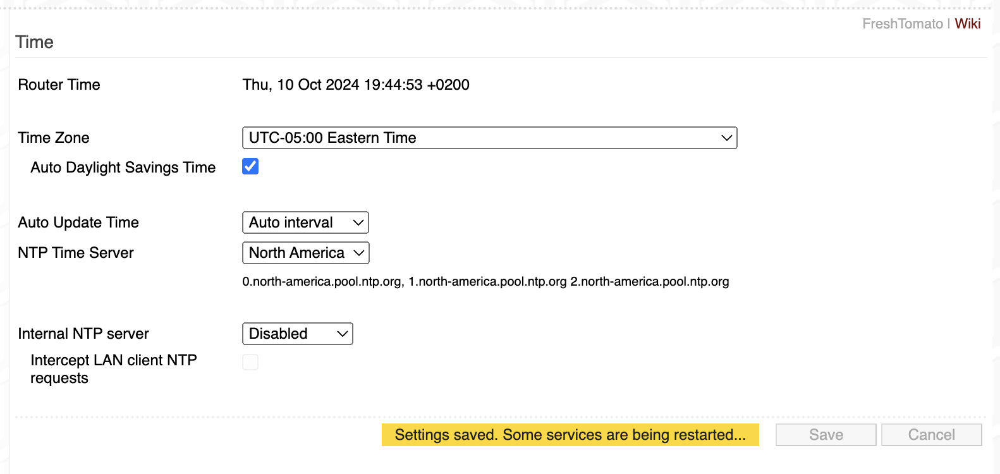

#  Tomato Router

Author: Suhani Mitra

Date: 2024-10-10

### Summary

For this skill, we had to configure a router based on the specifications. We had to first power the router, then connect the Internet port to a respective O-port in the classroom. We modified the name, key, security type, time zones, etc as the skill lists out. The screenshots below show the modifications we made.

### Evidence of Completion

Changing the Key

Changing Time Zone Info

### AI and Open Source Code Assertions

- I have documented in my code readme.md and in my code any
software that we have adopted from elsewhere
- I used AI for coding and this is documented in my code as
indicated by comments "AI generated" 

