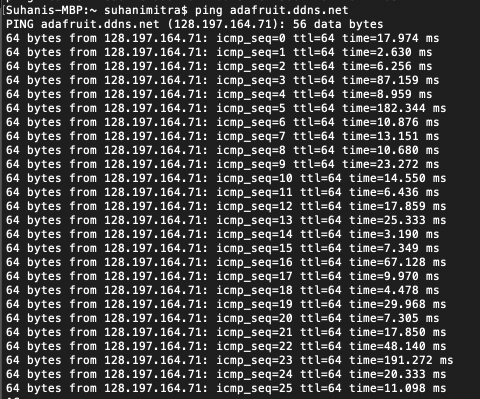

# Dynamic DNS

Author: Suhani Mitra

Date: 2024-10-11

### Summary

This skill was about linking a dynamic DNS to our router. To do so, we used noip.com to create a dynamic DNS hostname/link. We integrated this in with our router and ensured they were connected. Then, we set up port forwarding from an internal address to a local host that we opened up on a browser, in our case port 3000. We also pinged the DDNS hostname and successfully received bytes.

### Evidence of Completion

DDNS

Port Forwarding to Access Using Port 3000

Accessing Our DDNS Through Hostname (my group member Kyla was running a "Hello World!" node server)

Successful Pinging of Our DDNS

### AI and Open Source Code Assertions

- I have documented in my code readme.md and in my code any
software that we have adopted from elsewhere
- I used AI for coding and this is documented in my code as
indicated by comments "AI generated" 

