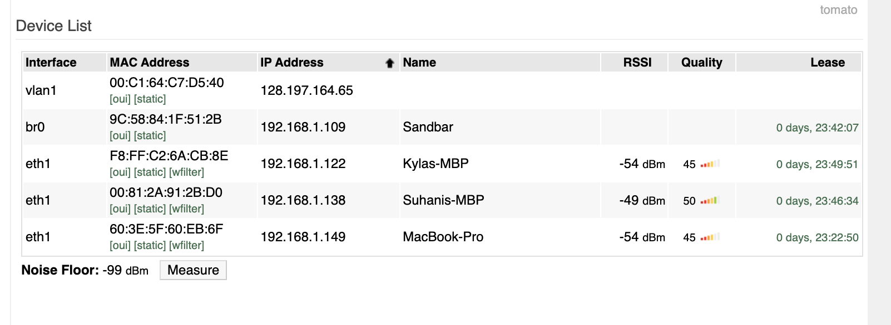
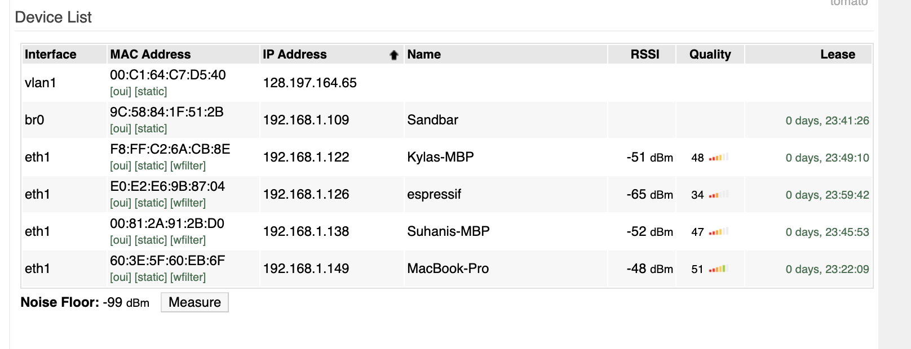
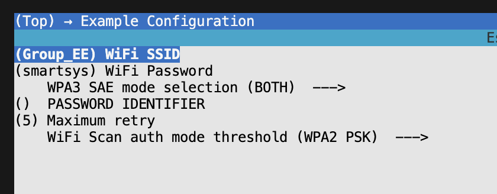

#  WiFi

Author: Suhani Mitra

Date: 2024-10-11

### Summary

This skill was about connecting our ESP32 to WiFi, specifically through our router. To do so, I flashed the provided code on my ESP32. Before that, I ensured that the menu configuration contained the correct SSID and password as per our settings. My ESP32 successfully connected as it was then visible in the device list page of our router (see images).

### Evidence of Completion

Device List Before ESP32 Connection

Device List After ESP32 Connection

Configuration with our WiFi Details

### AI and Open Source Code Assertions

- I have documented in my code readme.md and in my code any
software that we have adopted from elsewhere
- I used AI for coding and this is documented in my code as
indicated by comments "AI generated" 

