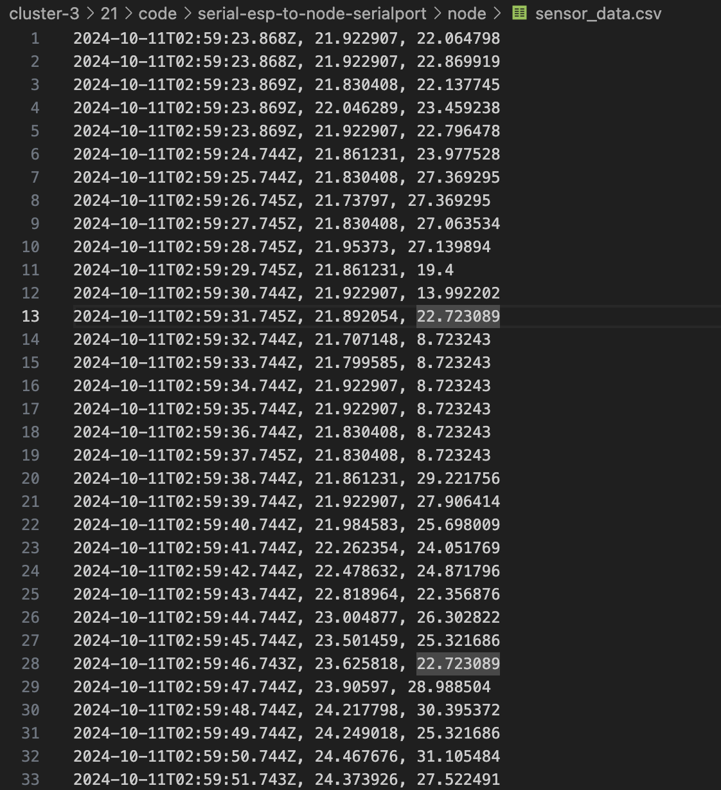
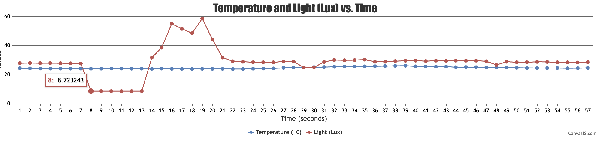

#  Node.js and Serial Data to CanvasJS and to a File

Author: Suhani Mitra

Date: 2024-10-10

### Summary

This skill involved feeding live data from the ESP32 port to our client browser. To do so I used socket.io as done in a previous cluster's skill. I created a node app to facilitate this connection. I used CanvasJS to plot the two sensor readings against time. Then, I also fed the live data results into a local file. The video below demonstrates this functionality —- I have the esp32 flashing, then start a node app, connect to the client browser, and am able to see the live graph update with temperature/light change. Similarly, the data file updates in real time with these data readings.

My circuit for the two sensor readings (temperature and photocell) is visible in the demo video. Here I used 10k resistors and read the voltages through two ADC channels. This was done similarly to how my team did it in our first quest. 

### Evidence of Completion

Live Data Stored to Local File 

Graphing Live Data Using CanvasJS

- [Link to video demo showing data graphically and stored in file locally.](https://drive.google.com/file/d/1E9coGtXFssr9rZeLYNdCKTdZsh0_YjoU/view?usp=drive_link)

### AI and Open Source Code Assertions

- I have documented in my code readme.md and in my code any
software that we have adopted from elsewhere
- I used AI for coding and this is documented in my code as
indicated by comments "AI generated" 

