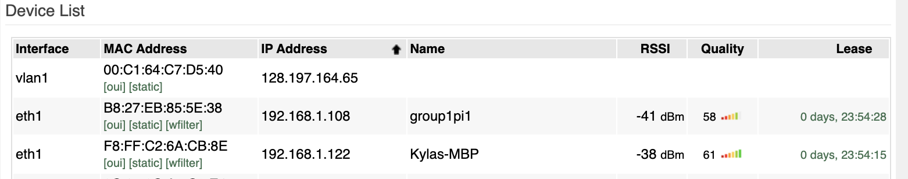
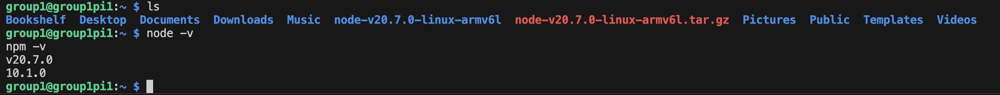
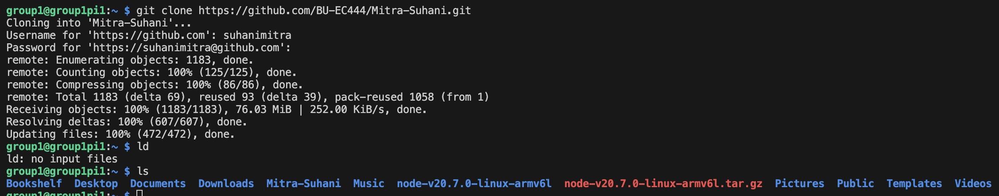
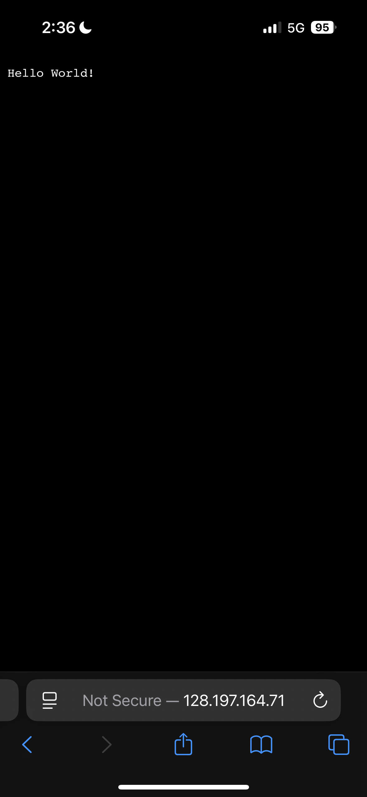

#  Raspberry Pi and Node.js

Author: Suhani Mitra

Date: 2024-10-22

### Summary

First, we flashed/set up the SD card with the Pi. We set up our WiFi SSID and password so the Pi could connect to our router. Then,  I SSH'd into my Pi and installed node.js following the provided instructions. I then cloned my git repository and used the node.js file I had in there to run a simple hello-world node example on the Pi. I used port forwarding and my router's IP to access the hello-world example on a device not on the router subnet (I used my phone on cellular service).

### Evidence of Completion

Pi Connected to Router

Node Downloaded on Pi

Git Clone on Pi

Running Node on Pi

Successfully Accessing Hello World on Phone

### AI and Open Source Code Assertions

- I have documented in my code readme.md and in my code any
software that we have adopted from elsewhere
- I used AI for coding and this is documented in my code as
indicated by comments "AI generated" 

