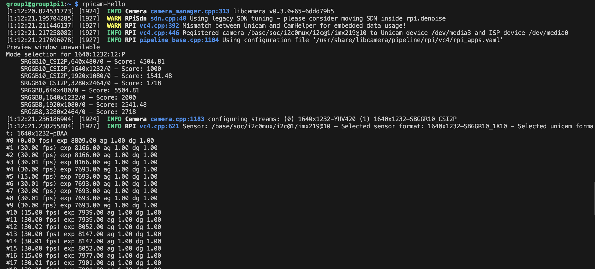
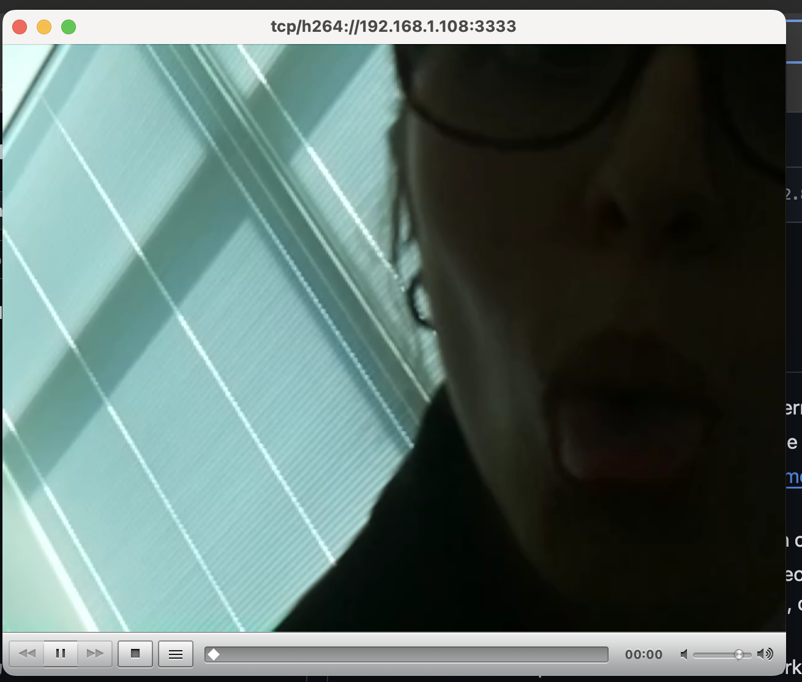

#  Pi Web Camera

Author: Suhani Mitra

Date: 2024-10-22

### Summary

This skill involved utilizing the Pi camera. To test, first I ran a simple hello-world to ensure the camera was functioning properly. Then, I opened a network on my local VLC app (my laptop) using the Pi's IP address and port number (3333) I specified when running "libcamera-vid -t 0 --inline --listen -o" on the pi (through SSH). The image/video below shows that the camera successfully works!

### Evidence of Completion

Running Hello World on Pi

Working VLC Camera! :)

- [Link to video demo of working camera footage on VLC.](https://drive.google.com/file/d/1nz_bGt-p3vJO1rE--AU-rZNb0tb71GUE/view?usp=drive_link).

### AI and Open Source Code Assertions

- I have documented in my code readme.md and in my code any
software that we have adopted from elsewhere
- I used AI for coding and this is documented in my code as
indicated by comments "AI generated" 

