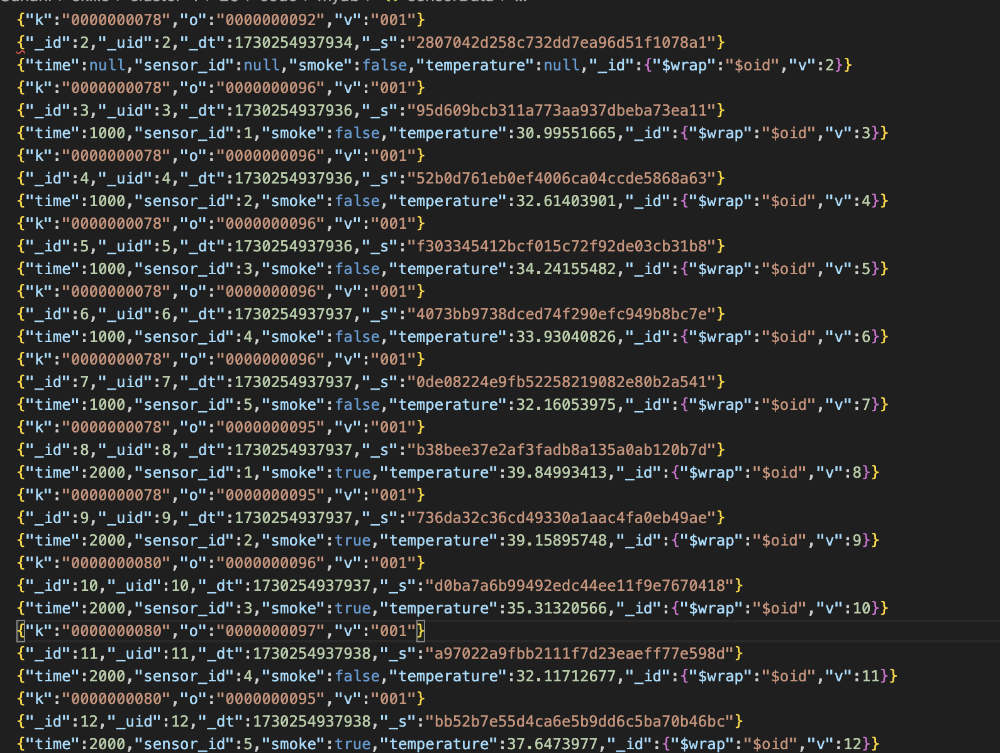
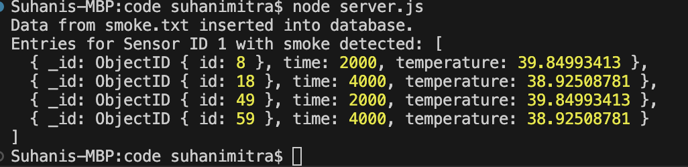

#  Databases

Author: Suhani Mitra

Date: 2024-10-29

### Summary

This skill involved installing tingoDB, and then bringing up a node server on a laptop. The server hosted a template sensor data (in this case from the file smoke.txt) as a data source. The server then parsed this data and wrote it into the database, as seen in the ./code/mydb/sensorData file (see the first image below). We then also queried the database to retrieve instances where sensor ID 1 had smoke and displayed this result as seen in the second image below.

### Evidence of Completion

Writing to DB

Output After Querying

### AI and Open Source Code Assertions

- I have documented in my code readme.md and in my code any
software that we have adopted from elsewhere
- I used AI for coding and this is documented in my code as
indicated by comments "AI generated" 

