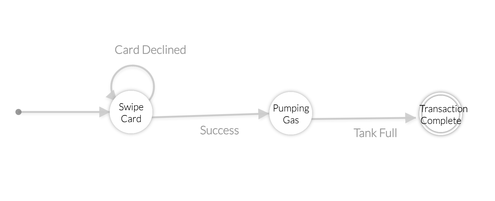

#  State Models

Author: Suhani Mitra

Date: 2024-10-29

### Summary

This skill involved creating an FSM for a self-service gas pumping situation. I defined 3 states and various actions. Once must swipe their card, wait for the gas to pump, then their transaction is complete. I created a corresponding table for the visual FSM which displays what state changes occur at certain events.

I also created C code that embodies this FSM and directs states to the correct next state based on what event occurred. I used the template code that used a switch statement to do so.

### Evidence of Completion

FSM for Self Service Gas Pumping

| Event/State | Swipe Card | Pumping Gas | Transaction Complete |
|---|---|---|---|
|Card Declined| Swipe Card | Swipe Card | Swipe Card |
|Success| Pumping Gas | Pumping Gas | Pumping Gas |
|Tank Full| Swipe Card | Transaction Complete | Transaction Complete |

### AI and Open Source Code Assertions

- I have documented in my code readme.md and in my code any
software that we have adopted from elsewhere
- I used AI for coding and this is documented in my code as
indicated by comments "AI generated" 
