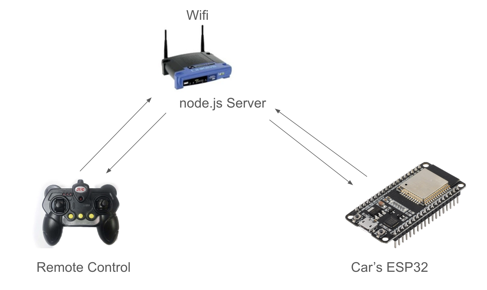

#  Security Issues

Author: Suhani Mitra

Date: 2024-11-01

### Summary

This skill involved understanding potential security issues a smart-connected system could face and ways to mitigate them.

### Evidence of Completion

The general flow chart we would need for this is as follows: 

Flow Chart (Driving a Car using Remote Control via Internet)

We would have a router setup. The car's microcontroller, an ESP32, would be connected to this. So is the remote control. The remote control sends data to a node.js server which receives the input. Then, the node transmits this command and sends data to the car's ESP32 which triggers the appropriate response in the car. This ESP32 will then relay a status update back to the node server which relays this back to the remote control.

Potential weaknesses include: an attack to corrupt client data, interception over the local network, eavesdropping over the Internet, server hacking, physical esp32 attacks, and falsified sensor data.

Here are five ways someone could attack this system and how we could mitigate each attack.

1. Malicious software on the remote control device could corrupt commands. This can cause the attacker to send dangerous commands (faster routing of the car).
  
   - To mitigate this, we can ensure that we use end-to-end encryption and multi-factor authentication to ensure that the commands are sourced from the correct source. We should also perform malware checks often.

2. Someone 'listens' in on data in between ESP/server contact by eavesdropping on the Internet. This contributes to a major loss of privacy.
   - To mitigate this, we could use transport-layer encryption so that data is secure from one source to another. We can also, as in the case explained above, use mutual authentication to ensure authentic client and server identities before we send/receive data.

3. Someone takes over the server which gives them access to all connected devices. This allows the attacker to program the cars to their liking (which can be malicious).
    - To mitigate this, we can add a firewall to the server and employ intrusion detection systems. This will ensure that our server is more secure.

4. Someone physically replaces the ESP32. This could send false data or intercept data.
    - To mitigate this, we can implement hardware security features like secure boot and encryption for the firmware itself such that new/unauthorized firmware cannot run.

5. Denial of service. An attacker interrupts command flow by flooding the server with requests which can cause an outage.
    - To mitigate this, we can limit request rates so that the server does not easily reach capacity.

### AI and Open Source Code Assertions

- I have documented in my code readme.md and in my code any
software that we have adopted from elsewhere
- I used AI for coding and this is documented in my code as
indicated by comments "AI generated" 

