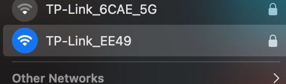
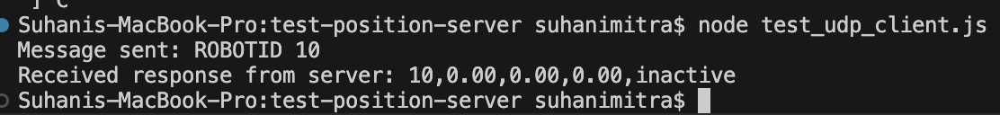

#  Optitrack Interfacing 

Author: Suhani Mitra

Date: 2024-11-23

### Summary

This skill involved using the optitrack motion capture system to track our purple car's motion. To enable this, we first had to connect to the same Wifi as the server. Then, we ran a test UDP client to ensure that we were able to ping the correct server. We used the optitrack server's IP and port: 192.168.0.167:41234. The second image below shows a successful ping.

Next, we integrated this into a UDP client into our ESP32 code, using the same IP and port combination. We also integrated the parse data file/functions such that we could process the data we received from the server. We had to make sure that the payload request matched the request format in the example node file and used our respective car ID: "ROBOTID 2."

The video below shows real-time tracking of our car, where the coordinates update once the car moves. The console coordinates update after we move the car.

### Evidence of Completion

Connecting to the correct Wifi

Successful ping to server

- [Link to video demo of receiving live optitrack data of our car.](https://drive.google.com/file/d/1H83EnfFUOYq14V4x0tLbQ7AH3Mz9F9WL/view?usp=drive_link).

### AI and Open Source Code Assertions

- I have documented in my code readme.md and in my code any
software that we have adopted from elsewhere
- I used AI for coding and this is documented in my code as
indicated by comments "AI generated" 

