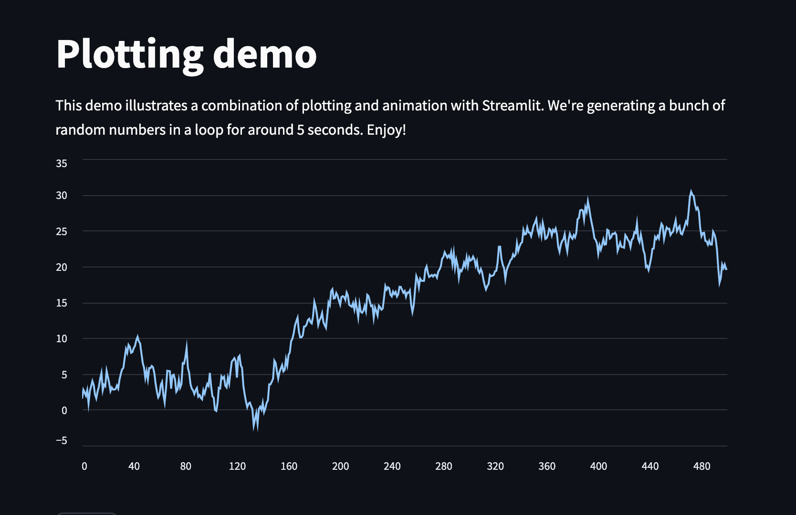
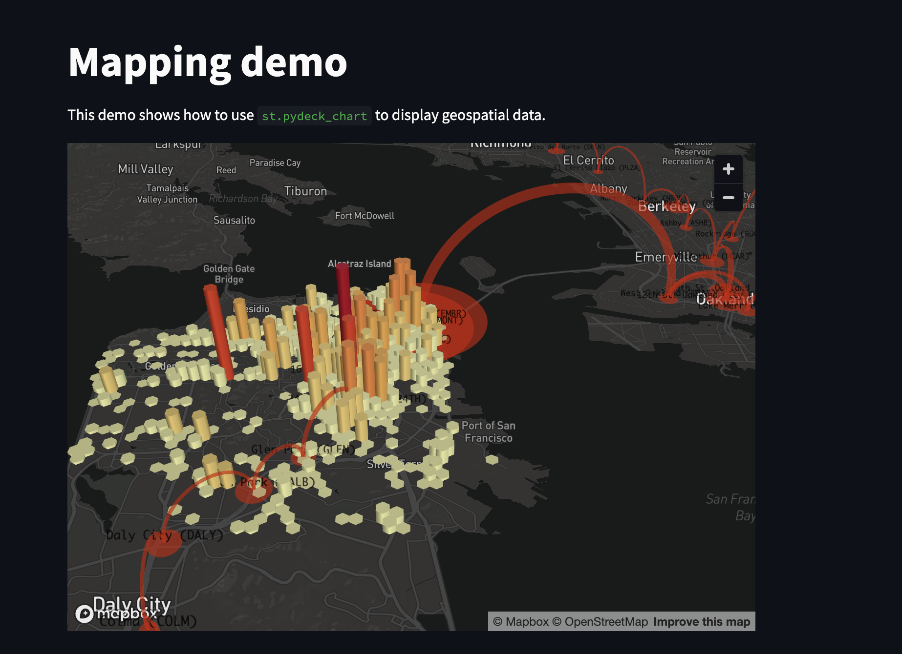
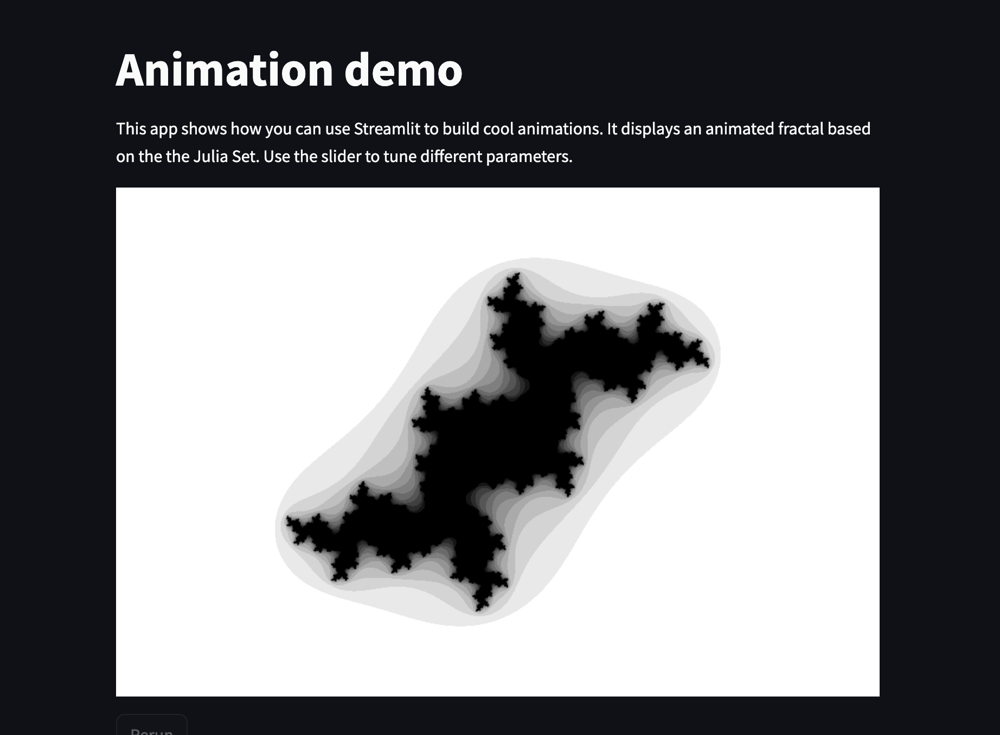
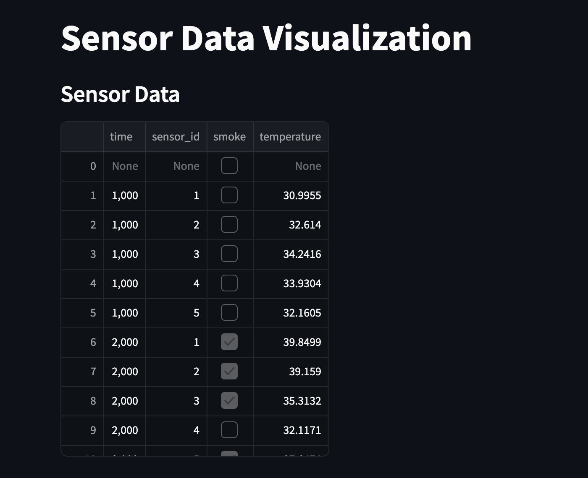
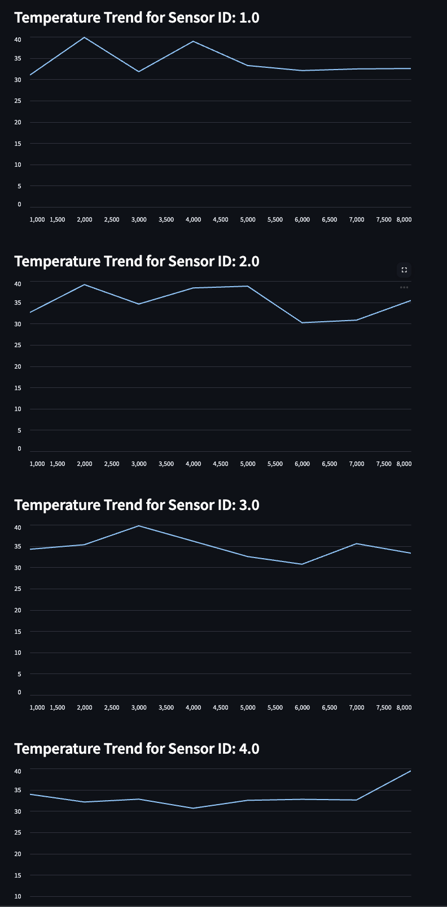

#  Streamlit Interface to DB

Author: Suhani Mitra

Date: 2024-11-23

### Summary

This skill involved connecting data to streamlit. To do so, I first downloaded streamlit to my laptop, through a python virtual environment. I ran the "streamlit hello" example which brought up the three images shown below.

Once I got this working, I had to integrate the data from skill 26 (tingoDB database). To do this, I had to first ensure that the smoke.txt sensor data was parsed correctly in valid JSON format. After ensuring this, I first loaded the data, then used the streamlit example plot code to aid with plotting the sensor data versus time. I used the help of ChatGPT to create this file (plot.py).

The streamlit interface successfully displays sensor data versus time for each unique sensor ID. There is also a table interface to highlight which times when smoke == true (as per skill 26 guidelines). The images below the streamlit examples demonstrate this.

### Evidence of Completion

Plot Example

Map Example

Animation Example

Table Interface with Smoke Data

Graphic of Smoke Data vs Time for Unique IDs

### AI and Open Source Code Assertions

- I have documented in my code readme.md and in my code any
software that we have adopted from elsewhere
- I used AI for coding and this is documented in my code as
indicated by comments "AI generated" 

